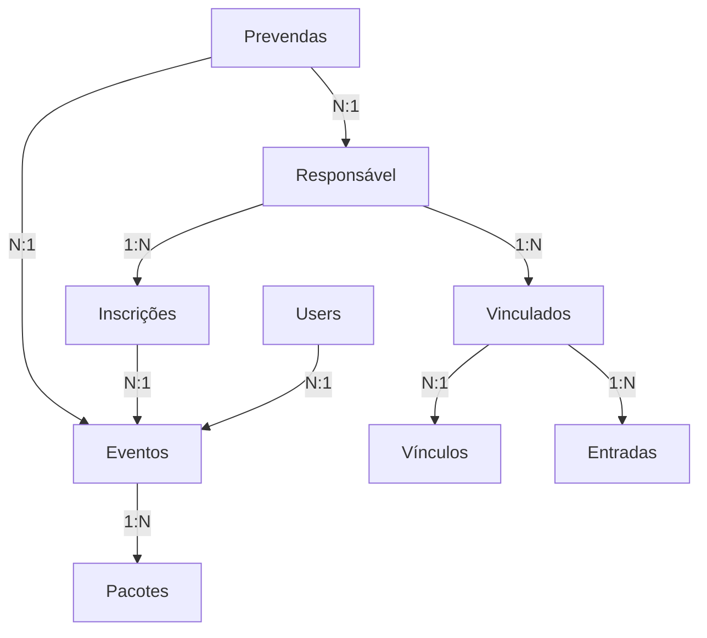

# 🎟️ Sistema de Bilhetagem Moderno

<p align="center">
  
  
  
  
</p>

Sistema moderno de bilhetagem e controle de acesso para eventos, desenvolvido em Laravel com interface responsiva em Tailwind CSS. Permite gestão completa de eventos, responsáveis, vinculados e controle de entrada/saída.

## 📋 Índice

- [🚀 Deploy & Instalação](#-deploy--instalação)
- [🏗️ Arquitetura do Sistema](#️-arquitetura-do-sistema)
- [📊 Models e Relacionamentos](#-models-e-relacionamentos)
- [🎮 Controllers](#-controllers)
- [🔐 Autenticação e Permissões](#-autenticação-e-permissões)
- [✨ Funcionalidades Principais](#-funcionalidades-principais)
- [📚 Guia de Uso](#-guia-de-uso)
- [🛠️ Desenvolvimento](#️-desenvolvimento)
- [🚧 Troubleshooting](#-troubleshooting)
- [📝 Changelog](#-changelog)

---

## 🚀 Deploy & Instalação

### Pré-requisitos

- **PHP 8.2+** com extensões: BCMath, Ctype, Fileinfo, JSON, Mbstring, OpenSSL, PDO, Tokenizer, XML
- **MySQL 8.0+** ou MariaDB 10.3+
- **Composer 2.x**
- **Node.js 18+** e **npm**
- **Servidor Web** (Apache/Nginx) ou PHP built-in server para desenvolvimento

### Instalação Rápida

```bash
# 1. Clonar o repositório
git clone <repository-url> bilhetagem-modern
cd bilhetagem-modern

# 2. Instalar dependências PHP
composer install

# 3. Instalar dependências Node.js
npm install

# 4. Configurar ambiente
cp .env.example .env
php artisan key:generate

# 5. Configurar banco de dados no .env
DB_CONNECTION=mysql
DB_HOST=127.0.0.1
DB_PORT=3306
DB_DATABASE=bilhetagem_modern
DB_USERNAME=seu_usuario
DB_PASSWORD=sua_senha

# 6. Executar migrações e seeders
php artisan migrate
php artisan db:seed

# 7. Compilar assets
npm run build  # Produção
npm run dev    # Desenvolvimento

# 8. Servir aplicação
php artisan serve
```

### Configuração Adicional

**Permissões de pastas:**
```bash
chmod -R 755 storage bootstrap/cache
```

**Cache de configuração (Produção):**
```bash
php artisan config:cache
php artisan route:cache
php artisan view:cache
```

---

## 🏗️ Arquitetura do Sistema

### Visão Geral

O sistema utiliza uma **arquitetura multi-evento com inscrições reutilizáveis**, onde:

- **Responsáveis** são globais e podem se inscrever em múltiplos eventos
- **Inscrições** conectam responsáveis a eventos específicos
- **Vinculados** pertencem ao responsável e são reutilizáveis entre eventos
- **Entradas** controlam acesso através dos vinculados



### Benefícios da Arquitetura

✅ **Reutilização de Dados** - Responsáveis não duplicam dados entre eventos  
✅ **Flexibilidade** - Mesmo responsável pode ter configurações diferentes por evento  
✅ **Escalabilidade** - Suporte para múltiplos eventos simultâneos  
✅ **Integridade** - Relacionamentos bem definidos previnem inconsistências  

---

## 📊 Models e Relacionamentos

### Responsavel
**Dados pessoais globais do responsável**

```php
// Campos principais
- nome, cpf, email, telefone1, telefone2, nascimento

// Relacionamentos
- inscricoes() -> hasMany(Inscricao)
- eventos() -> belongsToMany(Evento, 'inscricoes')
- vinculados() -> hasMany(Vinculado)
- entradas() -> hasManyThrough(Entrada, Vinculado)

// Métodos auxiliares
- estaInscritoNoEvento($eventoId) -> bool
- estaAtivoNoEvento($eventoId) -> bool
- inscricaoNoEvento($eventoId) -> Inscricao|null
```

### Inscricao
**Relacionamento entre responsável e evento**

```php
// Campos principais
- responsavel_id, evento_id, ativo, comunica, device_comunica, data_inscricao

// Relacionamentos
- responsavel() -> belongsTo(Responsavel)
- evento() -> belongsTo(Evento)

// Funcionalidade
- Permite mesmo responsável em múltiplos eventos
- Configurações específicas por evento (comunicação, status)
```

### Vinculado
**Pessoas vinculadas ao responsável**

```php
// Campos principais
- responsavel_id, vinculo_id, nome, nascimento, lembrar

// Relacionamentos
- responsavel() -> belongsTo(Responsavel)
- vinculo() -> belongsTo(Vinculo)
- entradas() -> hasMany(Entrada)

// Características
- Reutilizáveis entre eventos do mesmo responsável
- Tipos dinâmicos via tabela 'vinculos'
```

### Evento
**Eventos organizados**

```php
// Campos principais
- titulo, descricao, data_inicio, data_fim, local, capacidade, status

// Relacionamentos
- inscricoes() -> hasMany(Inscricao)
- responsaveis() -> belongsToMany(Responsavel, 'inscricoes')
- pacotes() -> hasMany(Pacote)
- entradas() -> hasMany(Entrada)
- users() -> hasMany(User)
```

### Vinculo
**Tipos de vínculos (dinâmicos)**

```php
// Campos principais
- descricao, ativo

// Relacionamentos
- vinculados() -> hasMany(Vinculado)

// Exemplos de vínculos
- Criança, Adolescente, Adulto, Idoso, PCD, Cônjuge, Familiar
```

---

## 🎮 Controllers

### ResponsavelController
**Gerencia responsáveis e suas inscrições**

```php
// Funcionalidades principais
- index() -> Lista responsáveis por evento
- store() -> Cria/reutiliza responsável + nova inscrição
- show() -> Exibe responsável com contexto de evento
- edit/update() -> Edita dados pessoais + configurações de inscrição
- toggleStatus() -> Altera status da inscrição
- bulkAction() -> Ações em lote (ativar/desativar/excluir inscrições)

// Características especiais
- Validação de CPF único por evento
- Reutilização automática de responsáveis existentes
- Gerenciamento de vinculados em formulários dinâmicos
```

### EventoController
**CRUD completo de eventos**

```php
// Funcionalidades
- index() -> Lista eventos com filtros
- store/update() -> Criação/edição de eventos
- show() -> Detalhes com estatísticas
- toggleStatus() -> Ativação/desativação

// Características
- Upload de imagens
- Configurações avançadas (preços, regras, comunicação)
- Controle de capacidade e horários
```

### EntradaController
**Controle de acesso e bilhetagem**

```php
// Funcionalidades
- index() -> Lista entradas por evento
- store() -> Registra nova entrada
- saida() -> Processa saída
- show() -> Detalhes da entrada

// Características
- Validação de vinculados ativos
- Cálculo de tempo de permanência
- Controle de pacotes e valores
```

### VinculoController
**Gestão de tipos de vínculos**

```php
// Funcionalidades
- CRUD completo para tipos de vínculos
- Validação de vínculos em uso
- Ações em lote

// Características
- Sistema dinâmico de tipos
- Proteção contra exclusão de vínculos em uso
```

---

## 🔐 Autenticação e Permissões

### Middleware AuthAdmin
**Controle de acesso baseado em roles**

```php
// Roles disponíveis
- admin: Acesso total ao sistema
- supervisor: Gestão de eventos e responsáveis
- operador: Controle de entradas e bilhetagem
- caixa: Operações financeiras

// Implementação
Route::middleware('auth.admin:admin,supervisor')->group(function () {
    // Rotas restritas
});
```

### Sistema de Permissões

| Role | Usuários | Eventos | Responsáveis | Entradas | Vínculos | Relatórios |
|------|----------|---------|--------------|----------|----------|------------|
| **Admin** | ✅ | ✅ | ✅ | ✅ | ✅ | ✅ |
| **Supervisor** | ❌ | ✅ | ✅ | ✅ | ❌ | ✅ |
| **Operador** | ❌ | ❌ | ✅ | ✅ | ❌ | ❌ |
| **Caixa** | ❌ | ❌ | ❌ | ✅ | ❌ | ❌ |

---

## ✨ Funcionalidades Principais

### 🎯 Gestão de Eventos
- **CRUD Completo** com validações robustas
- **Configurações Avançadas** (preços, capacidade, regras)
- **Status Control** (ativo, inativo, finalizado)
- **Integração** com todos os módulos do sistema

### 👥 Sistema de Inscrições Inteligente
- **Responsáveis Reutilizáveis** entre eventos
- **Validação de CPF** único por evento
- **Configurações Independentes** por inscrição
- **Vinculados Compartilhados** automaticamente

### 🚪 Controle de Acesso
- **Registro de Entrada/Saída** em tempo real
- **Validações de Vinculados** ativos
- **Cálculo Automático** de tempo de permanência
- **Integração com Pacotes** e preços

### 📊 Dashboard e Relatórios
- **Estatísticas em Tempo Real** por evento
- **Gráficos Interativos** de ocupação
- **Relatórios Exportáveis** (PDF, Excel)
- **Métricas de Performance** do evento

### 🔧 Administração Flexível
- **Tipos de Vínculos Dinâmicos** (criados pelo admin)
- **Usuários com Roles** específicas
- **Ações em Lote** para eficiência
- **Interface Responsiva** (mobile-first)

---

## 📚 Guia de Uso

### Primeiro Uso

1. **Acesse** o sistema: `http://localhost:8000/admin`
2. **Login** com credenciais do seeder: admin@example.com / password
3. **Crie seu primeiro evento** em "Gestão de Eventos"
4. **Configure vínculos** em "Vínculos" se necessário
5. **Adicione colaboradores** em "Usuários" (opcional)

### Cadastro de Responsáveis

```php
// Fluxo típico
1. Admin/Operador seleciona evento
2. Clica em "Novo Responsável"
3. Preenche dados pessoais (CPF, nome, contato)
4. Adiciona vinculados (nome, nascimento, tipo de vínculo)
5. Define configurações de comunicação
6. Sistema verifica se CPF já existe:
   - Se sim: reutiliza dados e cria nova inscrição
   - Se não: cria novo responsável + inscrição
```

### Controle de Entrada

```php
// Processo de entrada
1. Operador/Caixa acessa "Controle de Entradas"
2. Seleciona evento ativo
3. Busca vinculado (por nome/CPF do responsável)
4. Seleciona pacote/preço
5. Confirma entrada
6. Sistema registra timestamp e valida regras
```

### Relatórios

- **Dashboard Principal**: Métricas gerais e gráficos
- **Por Evento**: Estatísticas específicas (ocupação, receita)
- **Responsáveis**: Lista filtrada com opções de export
- **Entradas**: Controle de fluxo com relatórios de permanência

---

## 🛠️ Desenvolvimento

### Estrutura de Pastas

```
app/
├── Http/Controllers/     # Controllers principais
├── Models/              # Eloquent models
└── Middleware/          # Middleware customizado

database/
├── migrations/          # Estrutura do banco
└── seeders/            # Dados iniciais

resources/
├── views/admin/        # Views administrativas
├── css/               # Styles Tailwind
└── js/                # JavaScript/Vue components

routes/
└── web.php            # Rotas principais
```

### Padrões de Código

- **PSR-12** para estilo de código PHP
- **Eloquent ORM** para manipulação de dados
- **Blade Templates** para views
- **Tailwind CSS** para estilização
- **Vanilla JavaScript** (sem jQuery)

### Comandos Úteis

```bash
# Development
php artisan serve              # Servidor de desenvolvimento
npm run dev                    # Build assets (watch mode)
php artisan migrate:fresh     # Reset database
php artisan db:seed           # Popular dados iniciais

# Production
npm run build                 # Build assets otimizado
php artisan config:cache      # Cache configuração
php artisan route:cache       # Cache rotas
php artisan view:cache        # Cache views

# Debug
php artisan route:list        # Listar rotas
php artisan tinker           # REPL interativo
tail -f storage/logs/laravel.log  # Monitor logs
```

### Testes

```bash
# Executar todos os testes
php artisan test

# Executar testes específicos
php artisan test --filter=ResponsavelTest

# Coverage report
php artisan test --coverage
```

---

## 🚧 Troubleshooting

### Problemas Comuns

**❌ Missing required parameter for [Route]**
- **Causa**: Links antigos sem parâmetros atualizados
- **Solução**: Verificar views e incluir parâmetros necessários

**❌ CPF validation errors**
- **Causa**: Máscara não removida antes da validação
- **Solução**: Usar `preg_replace('/\D/', '', $cpf)` antes de validar

**❌ Relacionamentos vazios**
- **Causa**: Eager loading não configurado
- **Solução**: Usar `->with(['relacao'])` nas queries

**❌ Assets não carregando**
- **Causa**: Build não executado ou Vite não iniciado
- **Solução**: `npm run build` para produção ou `npm run dev` para desenvolvimento

### Debug e Logs

```bash
# Logs principais
tail -f storage/logs/laravel.log

# Debug queries
DB::enableQueryLog();
// ... sua query
dd(DB::getQueryLog());

# Debug routes
php artisan route:list | grep responsaveis
```

### Performance

**Otimizações recomendadas:**
- **Eager loading** para evitar N+1 queries
- **Indexes** em colunas frequentemente filtradas
- **Cache** para consultas pesadas
- **Paginação** em listas grandes

---

## 🚀 Roadmap SaaS

### Multi-Tenancy (Futuro)

**Estratégia Planejada**: Multi-Instância → Multi-Tenant

1. **Fase Atual**: Sistema single-tenant pronto para produção
2. **Fase SaaS**: Implementação de organizações e isolamento de dados
3. **Fase Scale**: Otimizações de performance e recursos avançados

**Benefícios da arquitetura atual para SaaS**:
- ✅ Responsáveis já são reutilizáveis (multi-eventos)
- ✅ Sistema de permissões robusto
- ✅ Arquitetura modular e escalável
- ✅ Fácil evolução para multi-tenant

---

## 📝 Changelog

### v2.0.0 - Arquitetura Multi-Evento (2025-08-27)
- **🎯 NEW**: Sistema de inscrições reutilizáveis
- **🎯 NEW**: Responsáveis globais multi-evento
- **🎯 NEW**: Vínculos dinâmicos configuráveis
- **🔧 IMPROVED**: Performance de queries com eager loading
- **🔧 IMPROVED**: Validações mais robustas
- **🐛 FIXED**: Problema de CPF único por evento

### v1.0.0 - Release Inicial (2025-08-26)
- **🎯 NEW**: CRUD completo de eventos
- **🎯 NEW**: Gestão de responsáveis e vinculados
- **🎯 NEW**: Controle de entrada/saída
- **🎯 NEW**: Dashboard administrativo
- **🎯 NEW**: Sistema de autenticação com roles

---

## 📄 Licença

Este projeto está licenciado sob a [MIT License](https://opensource.org/licenses/MIT).

## 🤝 Contribuição

Contribuições são bem-vindas! Por favor, siga as diretrizes:

1. **Fork** o projeto
2. **Crie** uma branch para sua feature (`git checkout -b feature/nova-funcionalidade`)
3. **Commit** suas mudanças (`git commit -m 'Add: Nova funcionalidade'`)
4. **Push** para a branch (`git push origin feature/nova-funcionalidade`)
5. **Abra** um Pull Request

---

<p align="center">
  Feito com ❤️ para gestão moderna de eventos
</p># bilhetagem-modern

